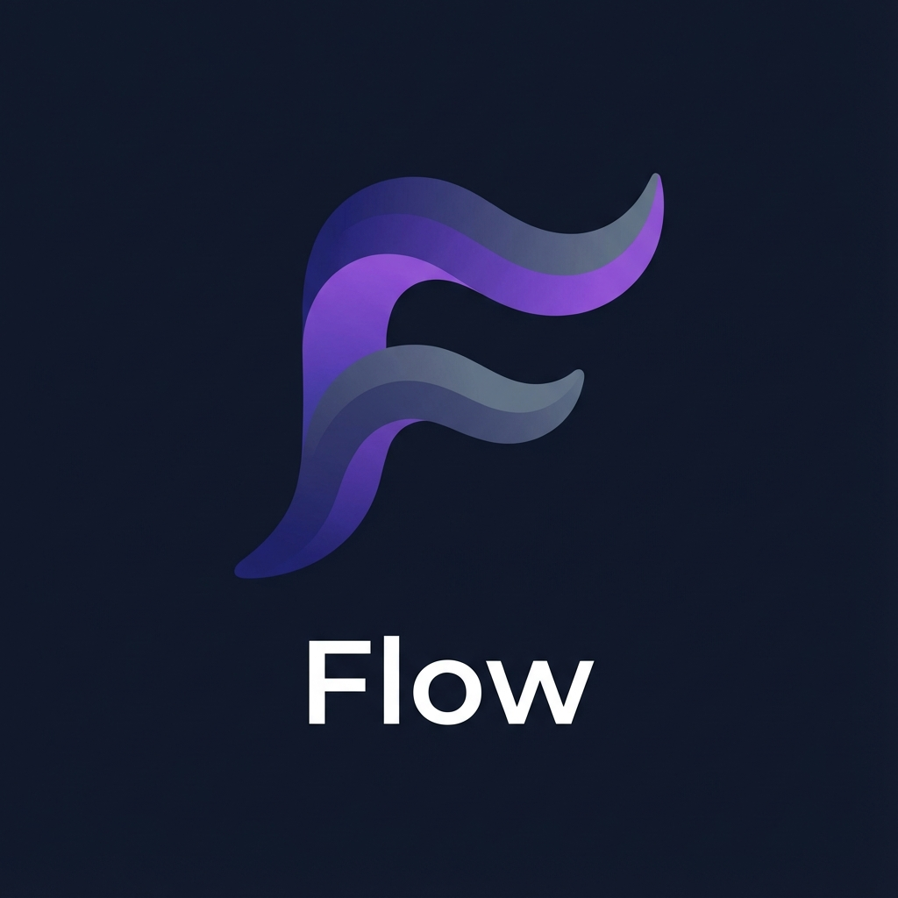
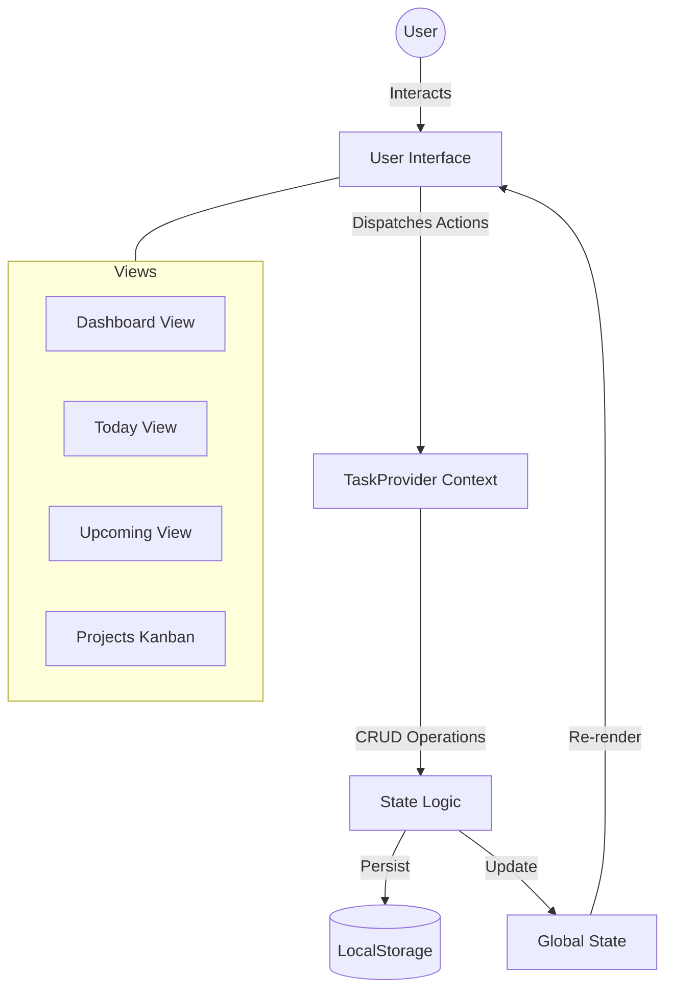
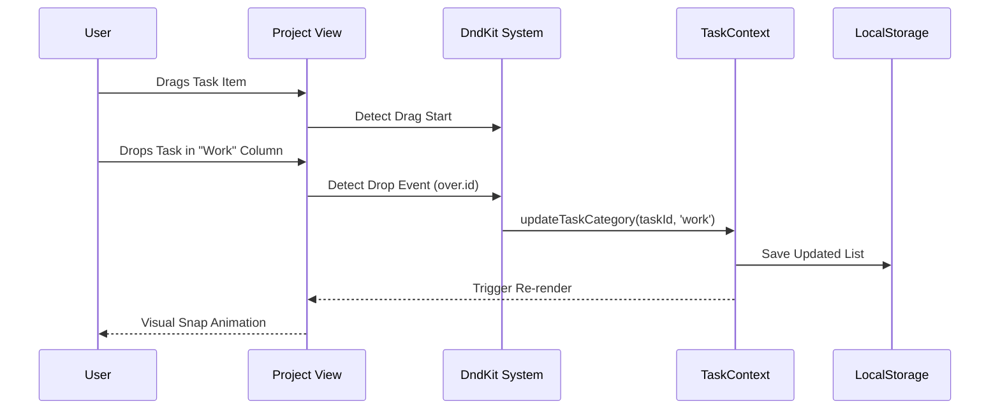

# Flow ToDo (Modern ToDo Stack)



[](https://reactjs.org/)
[](https://vitejs.dev/)
[](https://tailwindcss.com/)
[](https://web.dev/progressive-web-apps/)
[](./LICENSE)

**Flow ToDo** (Repo: `modern-todo-stack`) is a premium, mobile-first task management application designed to induce "flow" state. It combines robust functionality—like drag-and-drop organization and PWA installability—with a stunning "Big UI" aesthetic, deep dark mode, and fluid animations.

---

## 🏗️ Architecture & Flow

### System Overview

The app is built on a unidirectional data flow architecture using React Context for global state management and LocalStorage for persistence.



### Drag & Drop Workflow

Tasks can be seamlessly moved between project columns or rescheduled via drag-and-drop interactions.



---

## 🚀 Key Features

### 🌟 Dashboard Command Center

- **Visual Analytics:** Real-time filtered stats (Total, Done, Pending) with linear progress bars.
- **Interactive Filtering:** Click stat cards to slice the active task list by status.
- **Responsive Layout:**
  - **Mobile:** Smart vertical stack with hidden overflow protection.
  - **Desktop:** Asymmetric 60:40 split with 2x2 grid metrics.

### ✅ Advanced Task Management

- **Kanban Projects:** Drag & Drop tasks between categories (Project, Personal, Work, Health, Custom).
- **Smart Planning:** "Add to Upcoming" pre-fills tomorrow's date.
- **Custom Categories:** Create dynamic categories with custom colors and names.
- **Context Awareness:** Task metadata wraps intelligently on mobile to preserve screen real estate.

### 📱 PWA & Mobile Experience

- **Native Feel:** Full Progressive Web App support (Service Worker, Manifest).
- **Installable:** Add to Home Screen on iOS and Android.
- **Touch Optimized:** `44px+` touch targets, swipe-friendly interactions, bottom navigation.
- **No-Scroll Design:** Strictly constrained horizontal layout using `break-all` and flex shrinking to prevent layout shifts.

---

## 🛠️ Technology Stack

| Category | Technology | Purpose |
|----------|------------|---------|
| **Core** | React 18 | Component based UI |
| **Build** | Vite | Lightning fast HMR & bundling |
| **Styling** | Tailwind CSS | Utility-first styling system |
| **State** | Context API | Global state management |
| **Interactions** | @dnd-kit | Accessible drag-and-drop primitives |
| **Icons** | Lucide React | Consistent, scalable vector icons |
| **Mobile** | vite-plugin-pwa | Service Worker & Manifest generation |

---

## 📦 Installation & Setup

1. **Clone the repository:**

   ```bash
   git clone https://github.com/yourusername/modern-todo-stack.git
   cd modern-todo-stack
   ```

2. **Install dependencies:**

   ```bash
   npm install
   ```

3. **Run the development server:**

   ```bash
   npm run dev
   ```

4. **Build for production:**

   ```bash
   npm run build
   ```

## 📱 Mobile Installation (PWA)

1. **Access**: Navigate to the deployed URL on your mobile device.
2. **Install**:
   - **Android**: Tap "Install" in the prominent banner or Chrome menu.
   - **iOS**: Tap "Share" → "Add to Home Screen".
3. **Experience**: Launch from your home screen for a fullscreen, immersive experience.

---

*Designed with ❤️ for efficiency.*
